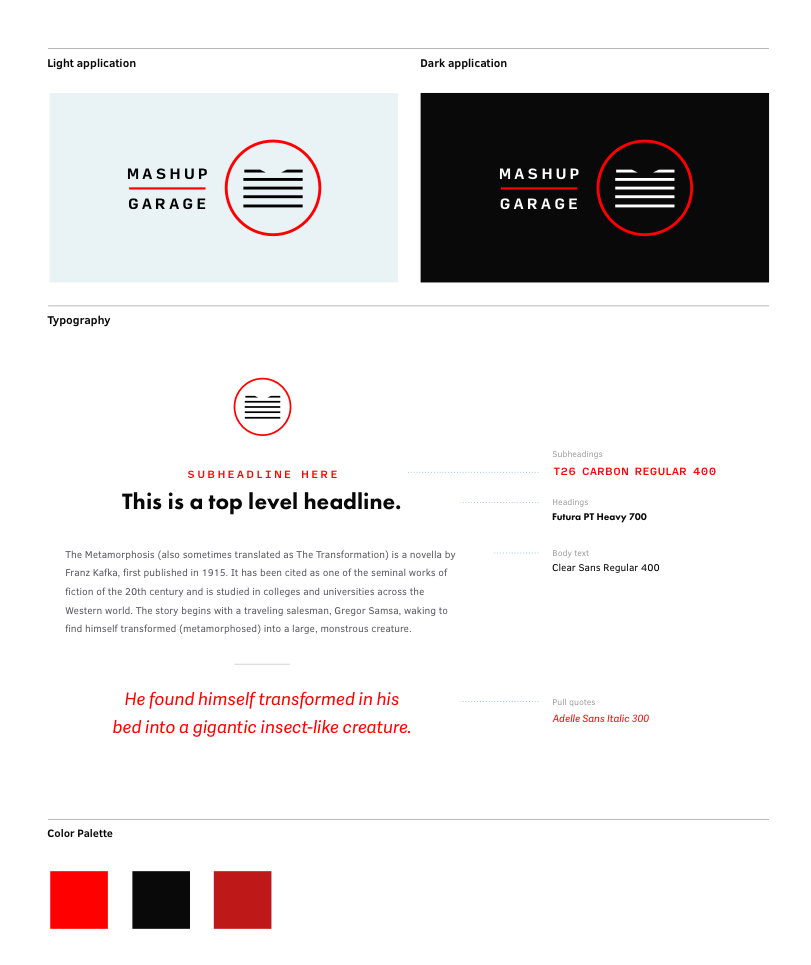

# Mashup Garage

Print-ready files:

* **[Raw logo files](logos/)** - SVG and PNG formats

References and others:

* [Composites](logos/comp/) - preview of logos in backgrounds
* [Applications](logos/application/) - avatars, etc
* [Sketch sources](sketch/) - editable sources

